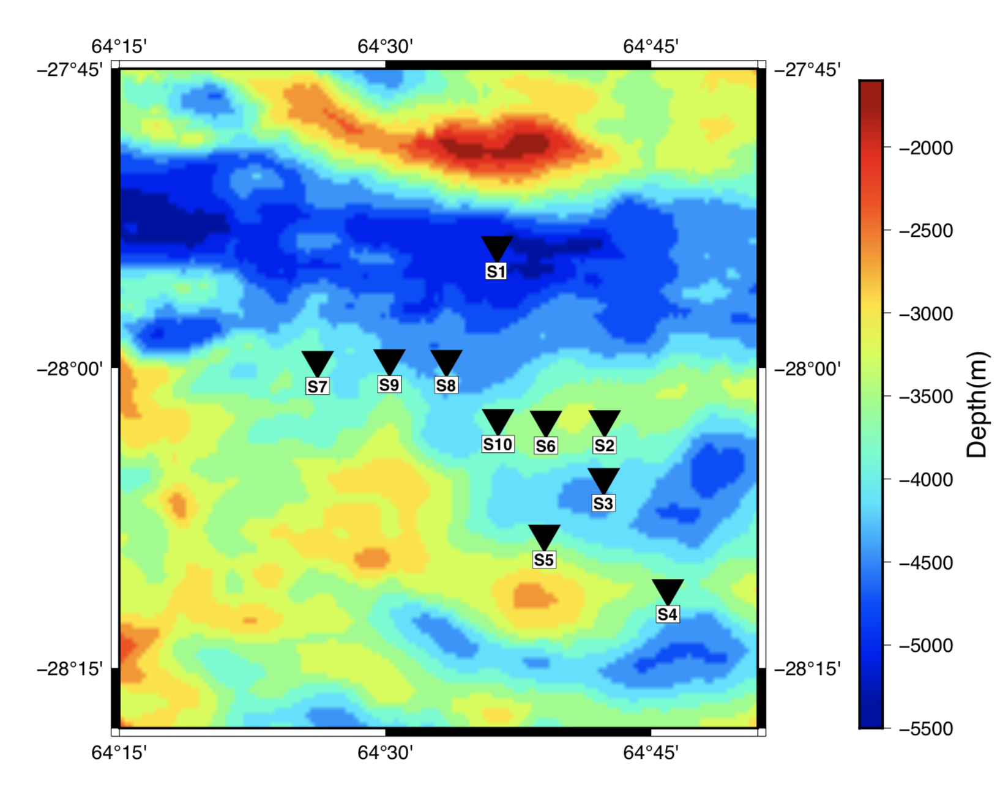

# GMT_SIMPLE_MAP
One of the geoscientific requirements is to have the stations on a map of regions.

This is a simple code in Bash to make a map and stations. The example of map can be seen in the following:



By typing the following command in your terminal, you can easily execute the code:

```
sh swir_map.sh
```
Before running, you also need to download the following file:

GEBCO_2020.nc

through the following link:
https://www.gebco.net/data_and_products/gridded_bathymetry_data/
